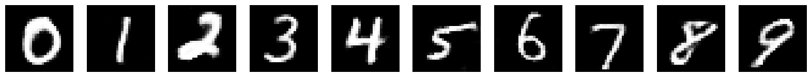

# MNIST Conditional VAE-GAN

Этот репозиторий содержит реализацию **Conditional Variational Autoencoder Generative Adversarial Network (CVAE-GAN)** для генерации изображений рукописных цифр на основе датасета MNIST. Модель сочетает в себе преимущества вариационных автоэнкодеров (VAE) и генеративно-состязательных сетей (GAN) для создания реалистичных изображений с учетом заданных меток (условий).

---

## Описание проекта

### **Цель проекта**
Целью проекта является создание модели, которая может генерировать реалистичные изображения рукописных цифр (0–9) на основе заданных меток. Модель использует комбинацию VAE и GAN, что позволяет:
1. **Кодировать** изображения в латентное пространство.
2. **Генерировать** новые изображения из латентного пространства.
3. **Контролировать** процесс генерации с помощью меток (условий).

---

## Архитектура модели

### **1. Энкодер (Encoder)**
Энкодер преобразует входные изображения в параметры латентного пространства (mu и logvar). Он состоит из сверточных слоев и полносвязных слоев.

### **2. Декодер/Генератор (Decoder/Generator)**
Декодер преобразует точки из латентного пространства обратно в изображения. Он использует транспонированные свертки (ConvTranspose2d) для увеличения размерности данных.

### **3. Дискриминатор (Discriminator)**
Дискриминатор отличает реальные изображения от сгенерированных. Он также учитывает метки (условия) для улучшения качества генерации.

---

## Установка и запуск

Установите зависимости с помощью команды:
```bash
pip install torch torchvision matplotlib
```

### **Запуск обучения**
1. Клонируйте репозиторий:
   ```bash
   git clone https://github.com/nadirg2/MNIST-CVAE-GAN.git
   cd MNIST-CVAE-GAN
   ```

2. Запустите обучение модели:
   ```bash
   python train.py
   ```

3. После обучения модель сохранит веса в папку `checkpoints/`. Вы можете использовать их для генерации изображений.

### **Генерация изображений**
Для генерации изображений используйте скрипт `generate.py`:
```bash
python generate.py --checkpoint checkpoints/model.pth --num_samples 10
```

---

## Примеры генерации

После обучения модель может генерировать изображения рукописных цифр. Вот примеры сгенерированных изображений:



---

## Структура репозитория

```
MNIST-CVAE-GAN/
├── checkpoints/          # Папка для сохранения весов модели
├── examples/             # Примеры сгенерированных изображений
├── models/               # Архитектуры моделей (энкодер, декодер, дискриминатор)
│   ├── encoder.py
│   ├── decoder.py
│   └── discriminator.py
├── train.py              # Скрипт для обучения модели
├── generate.py           # Скрипт для генерации изображений
├── requirements.txt      # Список зависимостей
└── README.md             # Документация
```

---

## Настройка гиперпараметров

Вы можете настроить гиперпараметры обучения в файле `train.py`:
- `latent_dim`: Размерность латентного пространства (по умолчанию 64).
- `num_classes`: Количество классов (10 для MNIST).
- `batch_size`: Размер батча (по умолчанию 128).
- `epochs`: Количество эпох обучения (по умолчанию 20).
- `learning_rate`: Скорость обучения (по умолчанию 0.0002).

---

## Лицензия

Этот проект распространяется под лицензией MIT. Подробнее см. в файле [LICENSE](LICENSE).

---

## Автор

- **Гулиев Надир**
- GitHub: [nadirg2](https://github.com/nadirg2)
- Email: [gulievnadir3@gmail.com](mailto:gulievnadir3@gmail.com)

